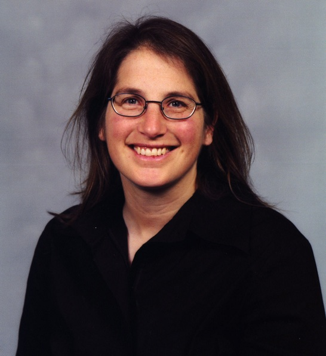
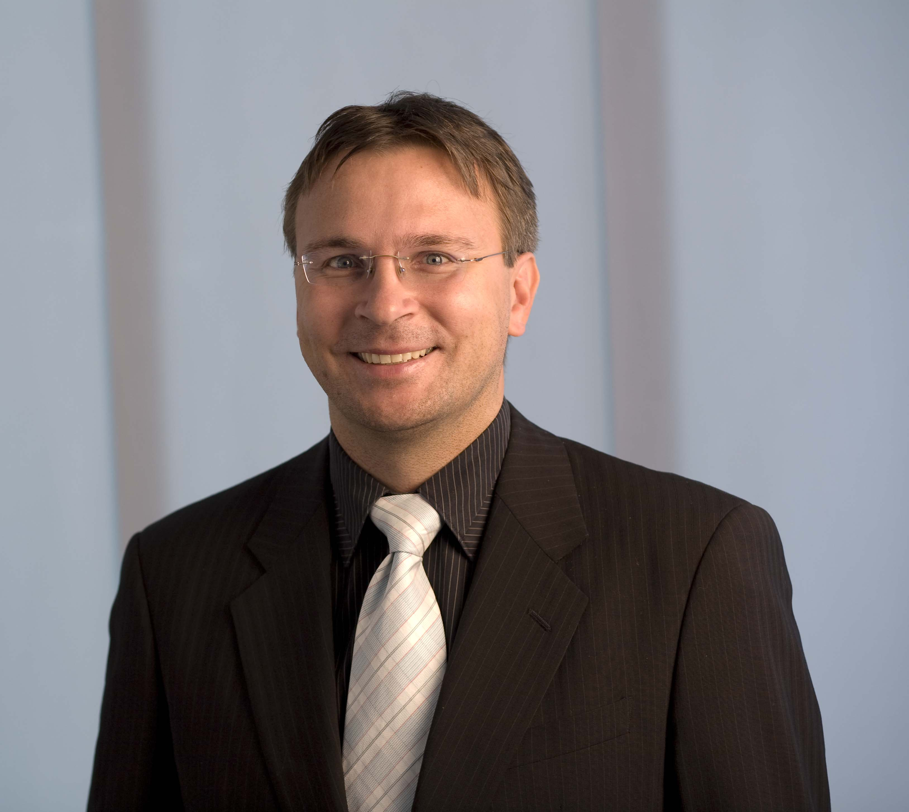

<link rel="stylesheet" href="../css/keynotes.css">

<h2>Prof. Myra B. Cohen</h2>

<b>Title: The Grass isn’t Always Greener:  A Changing Neighborhood and Varying Landscape  </b>

<b>Abstract:</b> 
Search based software engineering has been used to solve many problems in software engineering and as 
such many different search based algorithms have been utilized for optimizing problems across the full software lifecycle.  
Solutions range from simple greedy to local heuristic search to evolutionary, population based techniques.  
Choosing the algorithm to use for a particular problem is a key design decision.  However, an equally important decision, 
and one that is often less explored, is the design of the search neighborhood and the choice of its transformation operators.  
In this talk I will discuss some of our experience with varying the neighborhoods and transformation operators for problems 
such as software test generation and reverse engineering system models. I will show how this important design decision can have a 
large impact on the quality of a search algorithm for different variants of the same problem, because it fundamentally alters the search landscape.  
I will also show that while one neighborhood may be superior solving one variation of a problem, it may not work well at all for another variant 
of the same problem.

<b>Biography:</b> Myra Cohen is a Susan J. Rosowski Professor at the University of Nebraska-Lincoln where she has been a member 
of the Laboratory for Empirically Based Software Quality Research and Development, ESQuaReD since 2004.  
Her research expertise is in combinatorial testing and software testing of highly configurable software, 
software product lines, graphical user interfaces, and self-adaptive software.  
She regularly utilizes search based software engineering techniques in her research and teaches a graduate course on this topic. 
She has been a program committee member of many highly regarded software engineering conferences such as ICSE, FSE, ASE, ISSTA and ICST. 
She was the program co-chair of SSBSE in 2011, the GECCO SBSE track in 2010 and ISSRE in 2013. She was the general chair of ASE in 2015.

---

<h2>Dr. Joachim Wegener</h2>

<b>Title: Industrial Applications of Evolutionary Testing</b>

<b>Abstract:</b> Test case design could be easily interpreted as the search of the tester for an error-sensitive set of test cases. 
The application of search techniques to find an adequate set of test cases automatically is straight forward if an appropriate transformation 
of the testing goals into a fitness function could be defined. Therefore, numerous publications on evolutionary testing were published during 
the last two decades from researchers all over the world. Nevertheless, evolutionary testing has not found its way into industrial practice. 
Industrial applications are mostly limited to experimental case studies.

 

The keynote will present successful applications of evolutionary testing in industrial practice and will discuss the success factors. 
Most successful applications are from the test of embedded systems, since here often very complex implementations are required in order to realize single, 
well tangible system tasks. But also the aspects hindering a broader application of evolutionary testing in practice shall be discussed. 
The time is right for a wider introduction. 

<b>Biography:</b> Dr. Joachim Wegener studied computer science at the Technical University Berlin and received his PhD from Humboldt University Berlin. His thesis work, “Evolutionary Testing of real-time systems’ temporal behavior” gained him the “Best Dissertation in Software Engineering” award of the Ernst-Denert-Foundation and the German Computer Society, 2002. Joachim Wegener began his professional career as a scientist at Daimler AG Research and Technology.  For DaimlerChrysler research and advanced development he led the software analysis and testing group as well as a group on advanced techniques in software engineering.  Since 2007 he works for Berner & Mattner  Systemtechnik GmbH – a subsidiary of the Assystem group – specialized on embedded systems development services and products. At Berner&Mattner, Joachim Wegener is responsible for the departments in Berlin, Brunswick, Cologne and Wolfsburg as well as the product development.  He is one of the international leading industrial researchers in evolutionary and systematic testing and has more than ninety publications. He is the inventor of the successful classification tree editors CTE, CTE XL and TESTONA with several thousand users worldwide. 
