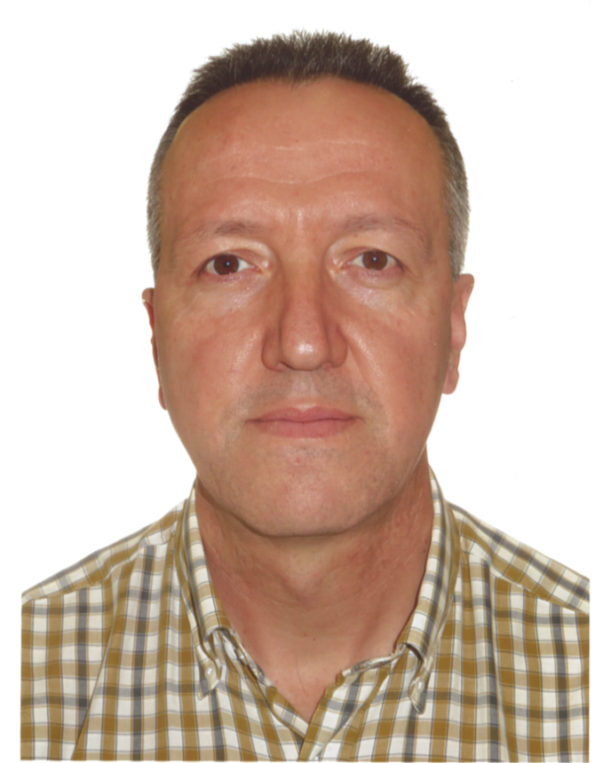
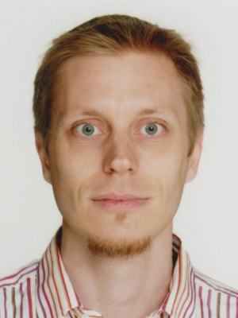

<link rel="stylesheet" href="../css/keynotes.css">

 

<h2>Prof. Antonio J. Nebro</h2>

<b>Title: Multi-objective optimization with the jMetal framework. Applications to SBSE</b>

<b>Abstract:</b>
jMetal is a Java-based framework for multi-objective optimization with metaheuristics which has become popular in some disciplines, including Search Based Software Engineering (SBSE). In this tutorial, we give a practical overview of the main jMetal components (algorithms, encodings, problems, operators, experiments, quality indicators), focusing on how to configure and run some of the included algorithms and also on how to incorporate new solution representations and problems. We give examples of classical algorithms but also more modern techniques, including preference-based metaheuristics. Some SBSE problems will be used as case studies.

<b>Biography:</b> 
Antonio J. Nebro received his M.S. and Ph.D. degrees in Computer Science from the University of Malaga, Spain, in 1992 and 1999, respectively. He is currently 
an Associate Professor of Computer Science at the University of Malaga, Spain. His current research activity is related to multi-objective optimization techniques, 
parallelism and Big Data, and the application of these techniques to real-world problems of the domains of bioinformatics and civil engineering. He has 
coauthored 30 articles published in international journals, 28 of which are indexed in JCR, 15 book chapters and more than 30 articles in international conferences. 
His H index is 30, and his papers have more than 3250 citations. He is one of the designers and main developer of the jMetal framework for multi-objective optimization with metaheuristics.

---

<h2>Dr. Dimo Brockhoff</h2>

<b>Title: Algorithms for Multiobjective Optimization and How to Benchmark Them</b>

<b>Abstract:</b>
Multiobjective optimization problems, in which two or more objective functions are to be optimized simultaneously, appear in many application domains. The field of search based software engineering is no exception.
Various algorithms for multiobjective optimization have been proposed in recent years, with the effect that the ultimate practical question when solving a concrete problem became increasingly difficult: which of the many available algorithm shall I actually use? To contribute to the answer of this question, we revisit several common multiobjective optimization algorithms in this talk and discuss their strengths and weaknesses from a more theoretical perspective. In addition, we look at the latest developments on how to benchmark (multiobjective) algorithms and showcase the performance of some common (and not so common) algorithms on the 55 unconstrained numerical blackbox functions of the biobjective BBOB test suite.

<b>Biography:</b> 
Dimo Brockhoff received his diploma in computer science from University of
Dortmund, Germany in 2005 and his PhD (Dr. sc. ETH) from ETH Zurich,
Switzerland in 2009. Later, he held two postdoctoral research positions in
France at Inria Saclay Ile-de-France (2009-2010) and at Ecole Polytechnique
(2010-2011) before joining Inria in November 2011 as a permanent researcher.
After working at Inria's Lille - Nord Europe research center for about five
years, he has been back to the Saclay - Ile-de-France center since October
2016 to become member of the new Randomized Optimization team.

His research interests are focused on evolutionary multiobjective
optimization (EMO), in particular on theoretical aspects of indicator-based
search, and on the benchmarking of blackbox algorithms in general. Dimo has
been involved in the co-organization of several special issues and workshops
around these topics such as the "SIMCO" and "SAMCO" workshops at the Lorentz
center in the Netherlands in 2013 and 2016 and the Blackbox Optimization
Benchmarking workshops at CEC 2015 and at GECCO 2013, 2015, and 2016.

---

<h2>Dr. Hermann Kaindl</h2>
 

<b>Title: Optimization Search for GUIs and Cyber‐physical Systems</b>

<b>Abstract:</b>
This tutorial presents and contrasts two different optimization search approaches studied by this proposer for automated GUI generation and for feature interactions in cyber‐physical automotive systems.  

Providing several GUIs tailored for multiple devices (desktop PCs, tablet PCs and smartphones) is desirable but expensive, and it takes time. Our new approach just requires a device specification with a few parameters for automated GUI tailoring in the course of design‐time generation from the same high‐level interaction design model. This tailoring is implemented as heuristic optimization search. 

With increasing numbers of features in automotive systems, feature interaction (FI) becomes more and more relevant regarding safety and emissions. Our new approach for optimization of feature interactions integrates an optimization objective (minimize CO2  emission) with both soft and hard constraints (e.g., related to certain temperatures). In the course of iterations of hill‐climbing optimization at run‐time, the integrating objective function is dynamically adapted for heuristic coordination of FIs. 

These approaches will be contrasted primarily in terms of the very different application domains and, more fundamentally, regarding design‐time vs. run‐time optimization with their very different requirements.

<b>Biography:</b> 
Hermann Kaindl joined the Institute of Computer Technology at TU Wien in Vienna, Austria, in early 2003 as a full professor. Prior to moving to academia, he was a senior consultant with the division of program and systems engineering at  Siemens  Austria.  There he has gained more than 24 years of industrial experience in software development and human‐computer interaction. He has published five books and more than 220 papers in refereed journals, books and conference proceedings, and he has previously run more than 50 tutorials. He is a Senior Member of the IEEE and a Distinguished Scientist Member of the ACM, and he is on the executive board of the Austrian Society for Artificial Intelligence. In the past, Hermann Kaindl published his basic research on Heuristic Search in Artificial Intelligence in the AIJ, several IEEE Transactions, and in many Conference Proceedings of IJCAIs, AAAIs and ECAIs.

---

<h2>Dr. Gordon Fraser</h2>
 

<b>Title: Search-based unit test generation with EvoSuite</b>

<b>Abstract:</b>
EvoSuite automatically generates test cases with assertions for classes written in Java code, using a search-based approach that evolves whole test suites towards satisfying a coverage criterion. For the produced test suites, EvoSuite suggests possible oracles by adding small and effective sets of assertions that concisely summarize the current behavior; these assertions allow the developer to detect deviations from expected behavior, and to capture the current behavior in order to protect against future defects breaking this behaviour. In this tutorial, we will discuss how to use of the EvoSuite search-based test generation infrastructure to apply search-based test generation, and how to build on EvoSuite to develop new techniques using, or extending, search-based testing.

<b>Biography:</b> 
Gordon Fraser is a Senior Lecturer in Computer Science at the University of Sheffield, UK. He received his Ph.D. from Graz University of Technology, Austria, in 2007, and worked as a post-doc researcher at Saarland University, Germany. He has published on improving software quality and programmer productivity at all major software engineering venues (e.g., TSE, TOSEM, ICSE, ISSTA, FSE, ASE, ICST). He is chair of the steering committees of the International Conference on Software Testing, Verification, and Validation (ICST) and the Symposium on Search-Based Software Engineering (SSBSE). He has been programme chair of several testing-related conferences (ICST, TAP, TAIC PART, SSBSE) and workshops, is a regular member of many programme and organising committees in the field (e.g., ICSE, FSE, ASE, ISSTA), and is editorial board member of the IEEE Transactions on Software Engineering (TSE) and Software Testing, Verification, and Reliability (STVR) journals. He is a founder and one of the core developers of the EvoSuite search-based unit test generator.

---
